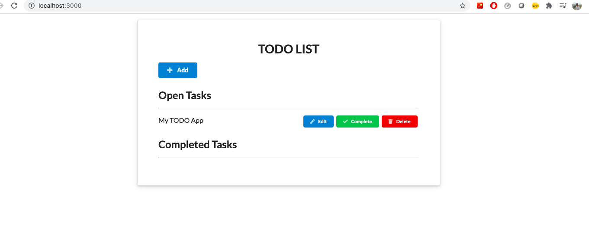
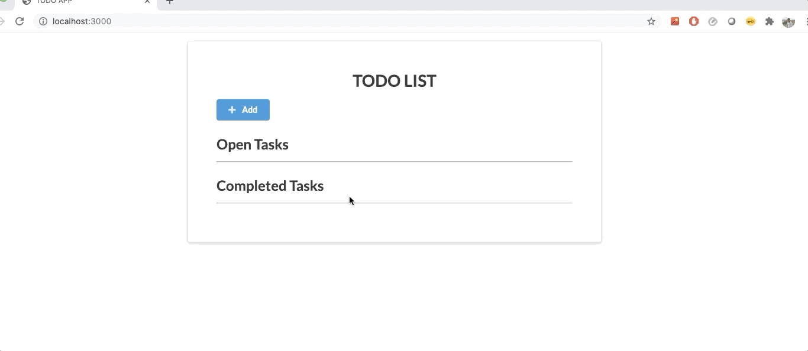
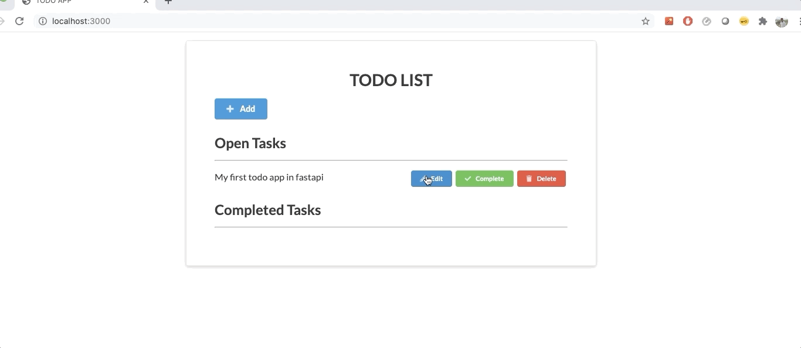
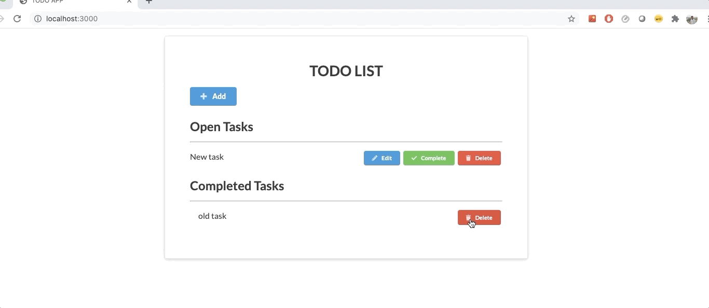
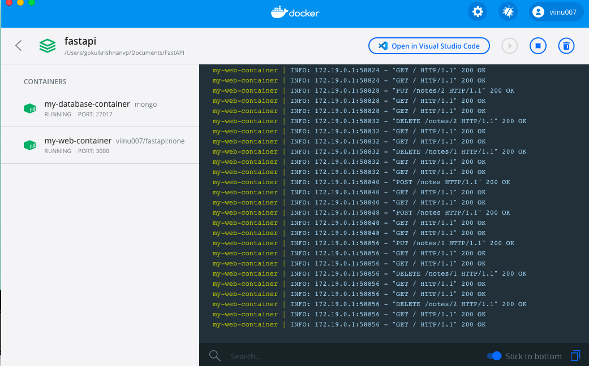

# ToDo APP with Fastapi and MongoDB(Motor) and Docker

This app is built using Fastapi and MongoDB and for ui styling Jinja2 was used with schematic UI(https://semantic-ui.com/)

Homepage of the App

Login of the App - fast api auth for one time
user name - viinu
password - training

Add new Task

Update the existing Task

Marking the task complete

Deleting the task

Docker commands
Docker image was build out of the app and upload to repositroy
so we can directly docker-compose.yml file and use docker-compose up command to run the app

